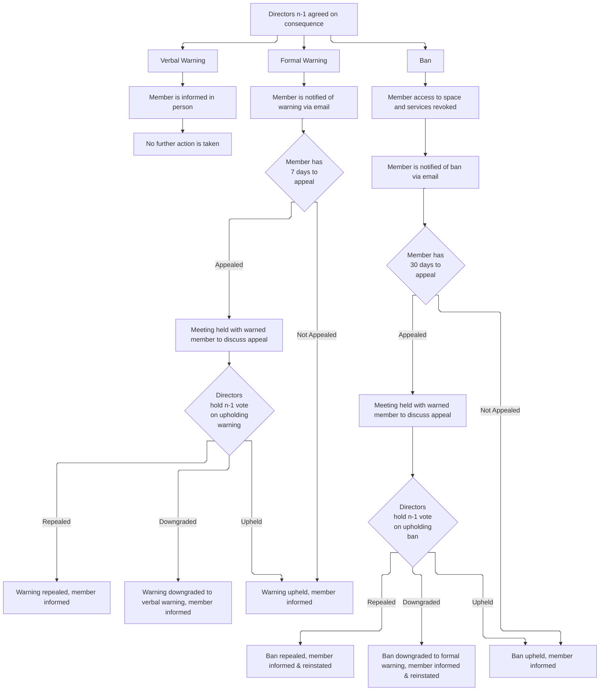
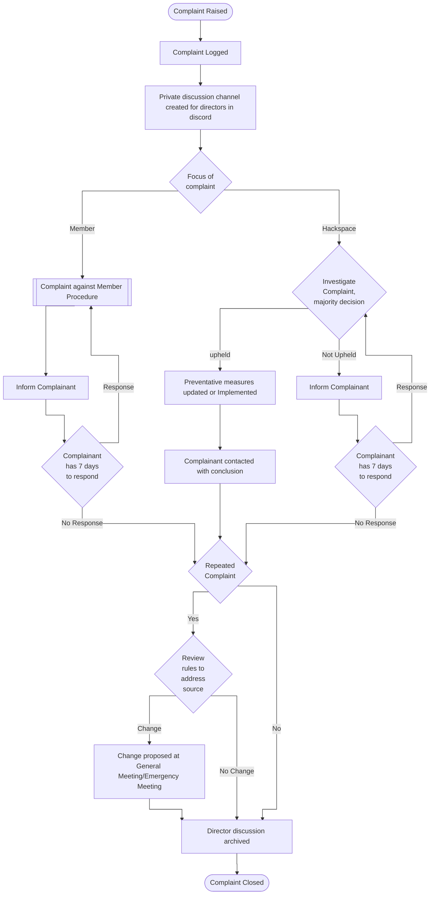
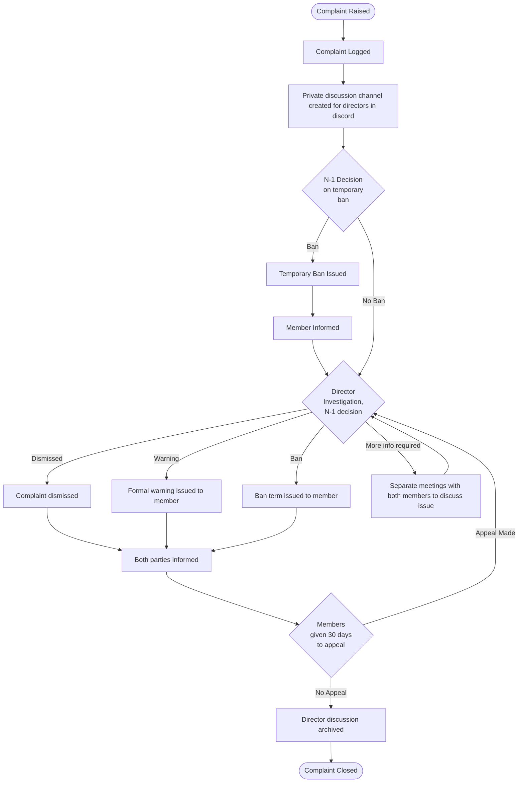

+++
title = 'Warnings and Complaints'
slug = 'complaints-warnings'
date = 2025-03-16T22:29:01Z
+++

## Warnings
Leicester Hackspace operates on a "Three strikes and your out" consequence system. When a member is found to have broken
a rule, they will receive a written warning. Once a member receives 3 written warnings, their membership will be
revoked, and they will not be allowed to re-join for at least 2 years. Warnings will expire after a year from date of
issue.  
Written Warnings will be issued at the discretion of The Directors. Bans must be agreed between directors with an
N-1 vote.

Additional actions can be taken alongside written warnings, including but not limited to:
- temporary bans
- bans from using specific equipment
- Bans from visiting the space on specific days
- Requirement to retake induction on equipment

A director may choose to give a verbal warning, which will not be recorded but may be discussed and taken into account
in future warnings.

The Directors may choose to forgo the process and skip straight to a ban if they deem the infraction serious enough
(E.g, causing serious damage or harm through malicious actions).

### Appeals
If a member feels that they have unfairly received a warning or a ban, then they can appeal within 30 days by writing to
[appeals@leicesterhackspace.org.uk](mailto://appeals.leicesterhackspace.org.uk) detailing their side of the warning and
why they think it was unjust.  
This will then be reviewed by the directors, who will N-1 vote on whether to uphold the warning/ban.

## Complaints
As Leicester Hackspace is intended to be a safe space for all members, we take complaints very seriously and have a
thorough process to ensure that they are handled correctly.

A complaint can be made by any member or non-member by emailing
[complaints@leicesterhackspace.org.uk](mailto://complaints.leicesterhackspace.org.uk). You can also choose to directly
email any or multiple directors using their email addresses, listed [Here](Wiki Link TODO).

***The following is lifted from Nottinghack's rules, the flow charts still need modifications to fit out process***

Complaints fall into one of three categories, set out in the sections below. These are given in priority order, and a
complaint falls into the first category it can fit into.

### Complaints Raised By or Against a Director
Complaints fall into this category is they are made by, or against, a Director or Directors where there is a need to
reduce conflicts of interest. This excludes situations where the whole Board are raising a complaint against a
particular member, which would require an N-1 decision.

A complaint against, or raised by, a director or directors creates a conflict of interest for the that Director(s). That
Director or Directors must be removed from all discussions and decisions about the complaint.

The remaining Directors should also consider whether they or any other Directors might have any conflict of interest due
to their relationship with the named Director(s). If they feel that they are unable to contribute to the discussion
dispassionately, they should remove themselves from the discussion.

If the number of Directors able to investigate and discuss the complaint is less than four, the Directors should not
proceed. At this point, the remaining Directors should arrange for the complaint to be heard by a panel of external,
independent, people. This is likely to be Directors/Trustees from another hackspace.

Once the investigating panel has been formed, the complaint follows the flow in the appropriate section below.

### Complaints Against Leicester Hackspace
Complaints fall into this category if they are made against the Hackspace as a whole, or a section of the organisation,
such as a team.

The primary purpose of the investigation is to determine the root cause of the complaint, identify any required changes
to the hackspace’s policy or procedures and deliver those changes.

### Complaint Against a Member
Complaints fall into this category if they are made by a member, members, or The Directors directly against a member or
members, or if a complaint is referred from the previous section.

We encourage you to raise a complaint for breaking any Hackspace rules, including if you:
- Feel that you have been harassed or bullied by another member
- Find someone sleeping in the hackspace
- Notice that a member is regularly leaving without cleaning up a large amount of mess
- Notice a member breaking UK legislation within The Hackspace

**If it is deemed necessary, a temporary ban from the space may be issued until the complaint is resolved. These must
only be used in severe cases where other people are at risk of harm.**

Whilst investigating a complaint, it may be necessary for the directors to have meetings with the complainant, and the
complained about member. In these cases, no more than 2 directors per attending member may be present for these
meetings, the attending member will be entitled to a friend to join for support, and minutes will be recorded and sent
to the attending member.

### Confidentiality and Openness
Complaints are very delicate issues, so details of all complaints will be kept in the upmost confidence. The Directors
cannot, and will not try, to stop a complainant from discussing their complaint with their friends, but The Directors
will not discuss with anyone outside the Directors and involved parties. Additionally, a Director who makes a
complaint will treat that complaint as if they received it for the purposes of confidentiality.

Finally, the Directors may choose not to share a complaint with the subject of that complaint if they deem the complaint
to be without merit. The complainant will be informed of this fact.
